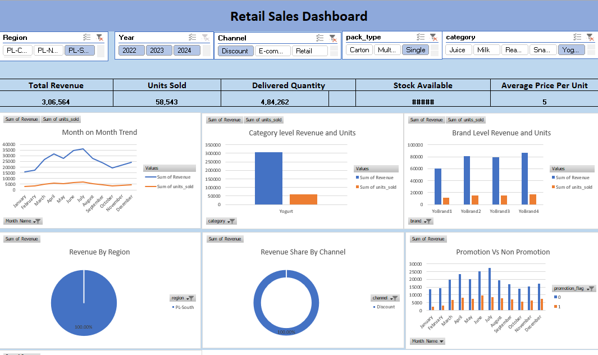

# 📊 Retail Sales Dashboard (Excel)

## 🔍 Overview

This project is an interactive retail sales dashboard built in Microsoft Excel to analyze sales performance across regions, categories, brands, and channels.

## 📌 Key Features

* Dynamic filtering using slicers (Region, Year, Channel, Pack Type, Category)
* KPI tracking: Revenue, Units Sold, Delivered Quantity, Stock Available
* Monthly sales trend analysis
* Category and brand-level performance comparison
* Channel-wise revenue share analysis
* Promotion vs Non-promotion impact

## 🛠 Tools Used

* Microsoft Excel
* Pivot Tables
* Pivot Charts
* Slicers
* Dashboard Design

## 📈 Key Insights

* Peak sales are observed during mid-year months (June–July), indicating strong seasonal demand.
* Revenue declines after July, suggesting a slowdown in later months.
* Yogurt is the top-performing category in terms of both revenue and units sold.
* Among brands, YoBrand4 generates the highest revenue, followed closely by YoBrand2 and YoBrand3.
* Revenue contribution is fairly distributed across regions (Central, North, South), with no extreme dominance.
* Discount channel contributes the majority of revenue, indicating high dependency on promotional pricing.
* Promotional sales consistently outperform non-promotional sales across all months.
* Despite high sales, stock availability needs attention (potential stock visibility/data issue observed).

 ## 📌 Recommendations
- Focus on high-performing categories like Yogurt
- Optimize discount strategies to improve profit margins
- Investigate stock data inconsistencies

## 📂 Files Included

*-[Retail_Sales_Dashboard.xlsx](Retail_Sales_Dashboard.xlsx) – Main dashboard file

## 📸 Dashboard Preview

## 🚀 Purpose

This project demonstrates data analysis and dashboarding skills using Excel for business decision-making.

